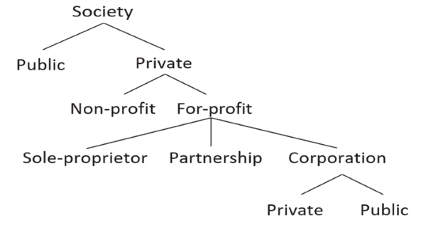
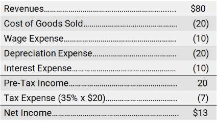
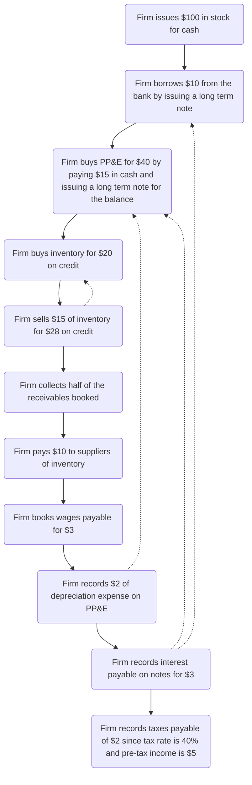
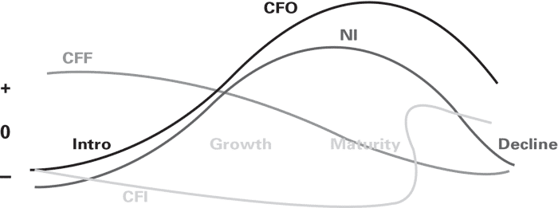
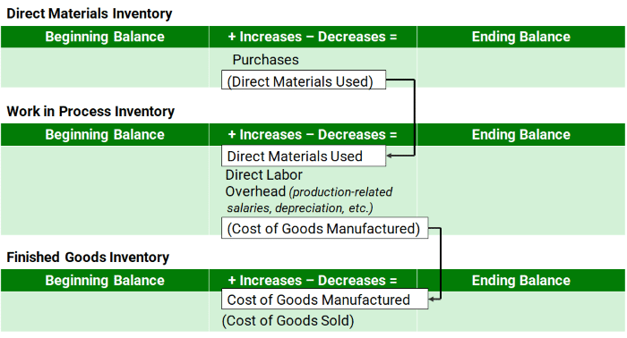

# 1 INTRODUCTION
## 1.1 The Purpose of Financial Accounting

- The U.S. Congress passed a law in 2002, known as the Sarbanes-Oxley Act (or “SOX” for short), that requires the Chief Executive Officer and the Chief Financial Officer to certify the firm's Financial Statements

## 1.2 Financial Accounting for Private Sector, For-Profit, Publicly Traded Corporations

- 
- S-Corporations are so-named because the tax requirements fall under Sub-Chapter S of Chapter 1 of the U.S. Internal Revenue Code
- Although LLCs and S-Corporations have certain benefits that are not granted to sole-proprietorships, their ownership structures have limits that prevent massive accumulation of capital, thereby typically limiting their size

## 1.3 Standard Setters and Auditors

- In the U.S., the accounting rules are written by the Financial Accounting Standards Board (FASB), located in Norwalk, Connecticut. This organization is under the jurisdiction of the SEC
- IASB GAAP is commonly referred to as International Financial Reporting Standards (IFRS). There are many GAAPs in the world – IASB and U.S. GAAP are the two most common GAAPs for publicly traded firms

## 1.4 Basic Terminology and Methodology

- 🔑 Assets = Liabilities + Owners' Equity
- The first sale of stock to public investors is called the Initial Public Offering (or IPO)
- Later, if it decides to sell more stock publicly, these subsequent sales are called Seasoned Equity Offerings (or SEO)

| Scenario | Double Entry |
|--|--|
| Borrow $100 Cash |  |
| Sell $100 Stock |  |
| Buy a Building |  |
| Buy Inventory |  |
| | |

### Balance Sheet

- The Balance Sheet is a listing of the balances from the ledger. As the name suggests, it shows the balances at a point in time. The “Begin” and “End” rows above (in the ledger) would represent this firm’s consecutive Balance Sheets
- Sell Inventory
    - 
    - Revenues (also called Sales) are recorded as increases in Owners’ Equity 
    - Cost of Goods Sold is recorded as a reduction in Owners’ Equity
- Pay Wages
    - 

### Income Statement

- Retained Earnings is the cumulative amount of Net Income that the firm has earned since its inception
- Whenever a firm decides to pay a dividend to its owners, Retained Earnings are reduced
- These are the cumulative earnings of the firm that are not paid out as dividends to owners

### Cash Flow Statement

- Operating cash flows – from customers and to suppliers
- Investing cash flows – for purchases of buildings and some other items
- Financing cash flows – to and from lenders and investors

*We point out the “dates,” namely the fact that the Balance Sheet is reported “as of” a particular point in time and the Income Statement and the Statement of Cash Flows are reported “for a period of time.” The reasons are because the Balance Sheet is a cumulative statement (a summation of events at a particular point in time), whereas the other two statements contain results over a reporting period, either one year or quarter. Also, below, we expand the Statement of Cash Flows to give some additional detail.*

## 1.5 Closing the Books

- The purpose of the closing entry is to re-set the balances in the revenue and expense accounts to zero so that they can accumulate the next period’s revenues and expenses
- Revenues and expenses hold their account balances temporarily-- they are called temporary accounts which are closed at the end of each accounting period

# 2 ADDITIONAL TERMINOLOGY, CONCEPTS, AND METHODOLOGY

## 2.1 The Accounting Cycle

Public firms in the U.S. must report their financial results quarterly. This means that they go through the so-called Accounting Cycle quarterly. The accounting cycle has four basic steps, outlined below.

1. The identification of accounting events. Accounting events are all events that firms are required to disclose under the accounting rules. The disclosures are made either in the Financial Statements or in the notes to the Financial Statements. Respectively, these are called “statement disclosures” and “note disclosures.” Both are important sources of information.
1. The valuation of accounting events. Firms must measure the events by putting a monetary value on them, if possible.
1. The recording of accounting events. Firms must formally record events in the accounting system so that they will be properly disclosed. Recording means that the firm either journalizes the event or provides a note disclosure, depending upon whether the event requires statement recognition (in which case the event is journalized) or note disclosure.
1. The disclosure of accounting events. Firms must generate a set of Financial Statements, along with the required note disclosures.

## 2.2 Capitalize vs Expense

1. Capitalize means that an asset increases
    1. When the pencil sharpener is capitalized, one asset is replaced by another (office equipment for cash).
    1. Notice that when the pencil sharpener is capitalized (the first instance above) the net effect on the firm is zero. The firm’s equation (Assets = Liabilities + Owners’ Equity) is unchanged. When the pencil sharpener is expensed, the firm “shrinks,” as both sides of the equation are reduced by $10.
1. Expense means that Owners’ Equity decreases
    1. When the pencil sharpener is expensed, both Assets and Owners’ Equity are decreased. The Owners’ Equity account is “Office Expense.” By way of semantics, we say that the effect of the expense is a reduction in Owners’ Equity, or we say that the expense is charged against the owners.
    1. If the pencil sharpener is capitalized, it will be expensed later, over time, in a systematic way, via the process of depreciation.

In both of the above instances, cash is reduced by $10. However, in the first instance, an asset account is increased to offset the decrease in cash. In the second instance, Owners’ Equity is decreased to offset the decrease in cash.

## 2.3 Gains and Losses vs Revenues and Expenses

Revenues vs Gains: when the firm’s central activity is selling inventory, the sale of the equipment results in a gain. 

- Intuitively, the gain is the difference between the fair value of the equipment ($1,000) and its book value listed on the Balance Sheet ($800).
- When the firm’s central activity is selling equipment, then the equipment would be classified as ”inventory,” and the firm would report revenue of $1,000 and an expense (Cost of Goods Sold) of $800 in the transaction. Notice that the result of the two different treatments is identical. 
- Assets increase by $200 (net) and Owners’ Equity increases by $200 (net). 
- The difference is in the level of detail. Peripheral activities are reported on a “net” basis; central activities are reported as two numbers, or on a “gross” basis (Revenues less COGS).

 ## 2.4 Statutory vs Effective Tax Rates

 1. Effective Tax Rate = Tax Expense / Pre-Tax Income
 1. When a firm uses a mixture of statutory rates, the Effective Tax Rate can differ from the local Statutory Tax Rate
 
 ## 2.5 Alternative Methods for Data Capture

 1. Debits are on the left, and credits are indented, thus on the right. In our context, debit simply means left, and Credit means right. 
 1. Debit does not mean “bad” or “negative” and credit does not mean “good” or “positive.”
1. There are no negative numbers with conventional journal entries.
1. Assets increase with debits and decrease with credits.
1. Liabilities and Owners’ Equity do the opposite. They increase with credits and decrease with debits.
1. Revenues, since they increase Owners’ Equity, are credits.
1. Expenses, since they decrease Owners’ Equity, are debits.

To add more structure to the instructions for the conventional journal entries, let’s outline some steps.

1. Identify the individual accounts involved in the transaction or event.
1. Classify the accounts in step 1 as Assets, Liabilities, or Owners’ Equity.
1. Determine whether the accounts are increasing or decreasing. (Remember that Revenues will be a credit because they increase Owners’ Equity, and expenses will be a debit because expenses decrease Owners’ Equity.)

# 3 PRACTICAL LOOK AT THEORETICAL ISSUES

## 3.1 Life Cycle of the Firm and the NI/CF Profile

Cash Flow Statement Impacts

1. Intro Phase
    1. When firms are just getting started, they usually have negative Net Income (a net loss) and negative CFO. This happens because it takes time (and money) to “set up shop,” identify a customer base, market to the customers, buy and deliver inventory, etc.
    1. Additionally, the firm is investing in infrastructure (equipment and buildings, e.g.), so its CFI will be negative. This means that cash is “going out” of the firm into these long-lived assets.
    1. If Net Income, CFO and CFI are all negative, the firm will definitely need outside sources of cash. Without cash, nothing happens. Thus, CFF will be positive. Cash will come from lenders and investors.
1. Growth Phase
    1. During the “growth phase,” CFO ceases being as negative and eventually turns positive. We say that the firm becomes “cash flow positive,” meaning that CFO becomes positive. 
    1. CFI will likely remain negative as the firm continues to spend cash on various long-lived assets such as buildings and equipment. 
    1. CFF often continues positive during the growth phase, since the firm still needs outside financing in order to fund its growing operations and investments in buildings, etc.
1. Mature Phase: During the “mature” phase, CFO is generally positive. CFI slows down as the firm has fewer investment opportunities. Also in the mature phase, CFF often turns negative, as the firm starts to pay down debt and to return cash to investors in the form of share repurchases and dividends.
1. Decline Phase
    1. Finally, during the decline phase, the firm’s CFO can turn negative as the firm is unable to sustain healthy operations.
    1. Firms may have to resort to selling assets to raise cash. In this case, CFI can become positive. Positive CFI means that the firm is liquidating assets to raise cash.

## 3.2 Predicting Cash Flows

- Future Financial Statements are called *pro forma statements*, or forecasted statements. 
- Pro forma means for the sake of form, or ”as if”. 
- One of the primary purposes of pro forma statements is to try to determine the firm’s future cash flows. 
- Most decisions concerning firms (for example, whether to buy a firm’s stock or to lend money to a firm) require an estimate of the firm’s future cash flows and sustainable cash generating ability.

## 3.3 Debt vs Equity

- Debt
    - Equity financing is more expensive than debt financing. 
    - Lenders can use various legal means to protect their claims, such as requiring collateral or limiting the use of the borrowed money. 
    - Such protections reduce lenders' risk, and when risk is lower, the "cost of capital" (the interest rate on the debt) is typically lower.
    - Debt is cheaper for another reason. Governments often subsidize debt financing by allowing tax deductions for interest payments. Therefore, debt has a tax advantage that makes it relatively cheaper than equity.
    - The use of debt has another advantage. It allows the firm to ⏴leverage⏵ earnings to the benefit of shareholders.
- Equity
    - “Stockholders” or “shareholders” are ways of describing the owners of equity. That is, the equity owner has purchased the firm’s stock (shares of ownership in the firm).
    - Stockholders do not have the same ability to protect their claims through collateral. Since stockholders assume more risk, they demand a higher return on their investment.
    - Dividends are usually not deductible. Deductions reduce the amount of taxable income and therefore the amount of money that firms would have to pay the government for taxes. 
- Convertibles
    - A mix between debt and equity is called a “convertible” or “convertible debt.” 
    - The terms of these hybrid investment vehicles vary but typically take the form of debt that are convertible into shares of stock. 
    - In other words, the debtholders earn a fixed return, but they could convert to stockholders and share in the extra returns. 
    - Once the conversion to shares of stock has been made, the investor has lost this debtholder status and is now a stockholder. 

## 3.4 Institutional and Theoretical Background

### SEC

#### Origin of the SEC

1. Overall, the purpose of the SEC is to ensure that full and fair disclosures are made to all investors before initial offerings and then afterwards in the secondary markets.
1. The SEC’s authority was granted by the U.S. Congress. The stock market “crash” of 1929 prompted the U.S. Congress (in 1933 and 1934) to institute changes that would hopefully reduce the likelihood of a repeat crash. 1. Congress passed the Securities Act in 1933 and the Securities Exchange Act in 1934. The Securities Act of 1933 regulates IPOs of securities— both stocks and bonds. 
1. The 1934 Securities Exchange Act regulates the subsequent trading of securities. It also created the SEC—the monitor that enforces the 1933 Act.

#### Filings

1. Form 10-K (annual filing, which includes the basic Financial Statements and notes plus other non-financial information)
    1. 10-Ks are required filings for all publicly traded firms in the U.S. 
    1. Firms may also elect to prepare another report called an Annual Report which is not required by the SEC. Annual Reports can be found in the “Investor Relations” section of a firm’s website. 
    1. The difference between an Annual Report and a 10-K is sometimes negligible. However, Annual Reports are often prepared for a wider array of users such as customers, potential employees and the mainstream press. 
1. Form 10-Q (quarterly filing of financial and non-financial information)
1. Form 8-K (filing after a significant event occurs, such as changes in directors, officers, or accountants)
1. Proxy (request for voting rights to be exercised at the annual shareholders’ meetings) 
    1. Generally, shareholders have the right to vote for directors of the firm and on other important matters, which are described in the proxy. Also included in the proxy is information on executive compensation.
    1. The technical form number assigned by the SEC to Proxies are Definitive 14-As or “Def 14-A” for short. 1. Other important information that you can find in Proxies include who the firm considers to be its peers (or firms with operations comparable to their operations). This type of insight is extremely helpful when analyzing a firm.

## 3.5 Agency Theory: The Need for Contracts and Regulatory Oversight

1. Cures for the problems of adverse selection and moral hazard include monitoring and incentive contracting.
1. Managers are answerable to creditors, and if they exploit creditors, their firm’s credit rating will fall. 
1. Further, just to be sure that they are protected, creditors will place restrictions on managers through certain provisions in their loans.
1. Some of the more well-known credit rating services in the world are Moodys, Standard & Poor’s, Fitch and A.M. Best. These rating services are paid to analyze the riskiness of a firm’s debt.

## 3.6 Accounting Principles

The principles established by the accounting profession include the Revenue Recognition Principle (or just Revenue Principle), the Expense Recognition Principle (commonly referred to as the "Matching Principle," which we will also often use), the Cost Principle, and the Full Disclosure Principle.

### Revenue Principle

- According to the Revenue Principle, a firm may recognize revenue after it has satisfied the performance obligation(s) identified in a contract with a customer. 
- Performance obligations are the goods or services promised to the customer in a contract. 
- For accounting purposes, such contracts do not have to be formal, signed documents, but can be implied through normal business practices. 
- For example, even buying groceries at the store represents an implied contract between the store, which has the obligation to provide groceries, in return for payment by the customer.
- An implication of the Revenue Principle is that certain non-cash transactions with customers can result in revenue being recognized, and conversely, certain cash transactions do not necessarily result in the recognition of revenue at the time cash is received. 
- *The critical event is the seller's satisfaction of a performance obligation. Payment can come after, or before, satisfaction of the performance obligation.*
- For instance, a consulting firm may receive an up-front payment from a client for a consulting project. The firm records the cash increase, but the firm does not yet have revenue because it has not yet performed the service.
- As another example, consider a retailer who issues a gift card. The retailer may receive cash payment for the gift card, but it may not book revenue until the card is redeemed (used) by the holder of the gift card.

### Expense Recognition Principle

- The Expense Recognition Principle (which, as indicated above, is commonly referred to as the Matching Principle) says to book the expense when the benefit is received, regardless of the timing of the cash flow. 
- *The expense is to be ”matched” with the revenue (the benefit), hence the name Matching Principle.*
- Therefore, the booking of revenue or expense does not necessarily correspond to cash flows. 
- The cash flow may occur either before or after the booking of the revenue or expense. Below, we describe several variations of revenues and expenses.

### Cost Principle

- The Cost Principle pertains mainly to the measurement of asset purchases. 
- Assets are recorded on the Balance Sheet at their cost, which means their cash value, or cash equivalent value. (Cash equivalent means the present value of future cash flows. 
- We will discuss present value briefly in an upcoming chapter.) The Cost Principle requires inclusion of all cash or cash equivalent outlays to bring the asset to its place of intended use by the firm. 
- Thus, the cost of a machine would include not only the invoice price, but also shipping, insurance, and installation.

### Full Disclosure Principle

- The Full Disclosure Principle pertains both to what is disclosed and how it is disclosed. 
- Firms must disclose all “relevant” financial information. 
- Relevant information is all information that would make a difference in the decisions of a “reasonable” lender or investor. 
- Another manifestation of the Full Disclosure Principle is the classified presentation of the Financial Statements.

Under U.S. GAAP, assets are listed in the Balance Sheet in the order of liquidity (“nearness” to cash or use). Typically the order will be:

1. Cash
1. Accounts Receivable
1. Marketable Investments (investments in the stock and bonds of other companies)
1. Inventory
1. Prepaid Rent and Insurance
1. Property, Plant and Equipment
1. Intangible Assets (Patents, Goodwill, etc.)

Liabilities are listed in the order of maturity, that is, when they have to be paid. Typically, the order will be:

1. Accounts Payable
1. Wages Payable
1. Taxes Payable
1. Short-Term Debt
1. Long-Term Debt
1. Bonds Payable (a type of Debt)

Owners’ Equity is listed in the order of permanence. By permanence, we mean the relative expectation about returning capital to the owners. 

1. Stock
1. Retained Earnings

## 3.7 Users, Qualitative Characteristics, and the Conservatism Constraint

The intended users of financial reports are any interested parties with a reasonable understanding of business and with a willingness to study the reports with reasonable diligence. The interested parties include investors, lenders, labor unions, the government, and competitors.

The disclosures made in the financial reports should be relevant and possess "representational faithfulness." 

## 3.8 Conservatism in Financial Accounting

The construct of conservatism is pervasive in many accounting regimes, including that of the U.S. Conservatism shows the worst-case scenario in order to alert lenders and investors about the downside of their investments.

Example of Conservatism: 

1. Contingent Losses
1. Expensing IP Costs instead of capitalizing them

## 3.9 Alternative Accounting Systems: Cash, Accrual, and Fair Value

1. The cash accounting system records only cash events.
1. The SEC, through the FASB, requires publicly traded firms to use the accrual accounting system.
1. Fair value accounting is an accounting system that is “bolted on” to the accrual system. The fair value system requires recognition of unrealized losses and unrealized gains, but only for certain select assets and liabilities.

## 3.10 Earnings Per Share: Basic Versus Diluted

EPS captures the earnings attributable to each shareholder.

- EPS is one of the major measures of a firm’s success. 
- The announced EPS is benchmarked against prior EPS for the firm and against the EPS of competitor firms.

Firms are required to give two EPS measures, so-called “Basic” and “Diluted.” 

| Basic EPS | Diluted EPS |
|--|--|
| Basic EPS measures the earnings attributable to each existing shareholder | Diluted EPS measures the earnings attributable not only to existing shareholders but also to those who could become shareholders by exercising their rights to do so. |
|  |  | 
| | One of the main adjustments to the denominator for Diluted EPS is for stock options. People who hold stock options have the right to purchase shares of stock at a predetermined price, called the exercise price or the strike price. |
| | Diluted EPS is lower than Basic EPS because Diluted EPS includes in the denominator the effects of the additional shares that could be issued from the exercise of the options. |
| | Another adjustment to the denominator is for convertible debt. Convertible debt is a type of debt that could be converted to shares of stock. If the debt is converted to stock, then more shares would be added to the denominator, further diluting EPS. |
| | |

# 4 WORKING CAPITAL ACCOUNTS

## 4.1 Cash

1. Working Capital
    - Working capital includes all of a firm's current assets and current liabilities.
    - Another variation of working capital is the “current ratio,” which is a relative measure, namely current assets divided by current liabilities.
1. Cash 
    - The valuation of cash in a firm's reporting currency is straightforward. (The reporting currency is the currency used in the firm’s financial statements that are filed with the regulatory authorities, such as the SEC. It is the currency of the “home country.”) 
    - Sometimes cash is restricted for a particular use, such as for expansion of a factory. In this case, the restricted cash is not classified as cash because it is not immediately "spendable." Rather, restricted cash is classified as an "other asset" or investment and is therefore not included in total cash and cash equivalents on the balance sheet.

## 4.2 Accounts Receivable

Accounts Receivable are rights to receive future cash from a customer from a previous sale on credit.

Other names for “Accounts Receivable” are receivables, trade receivables (where “trade” = customer) and trade debtors.

When a firm sells to customers on credit, the firm is exposed to credit risk, or the risk of not being paid. Credit risk must be measured and recorded.

## 4.3 Allowance for Doubtful Accounts

### 🔑 Net Realizable Value = Accounts Receivable - Allowance for Doubtful Accounts

## 4.4 Notes Receivable

Some sales have long payment terms, allowing customers to pay several months after the transaction. Firms that have to wait 90 days or more to be paid often charge interest. Thus, they book a Note Receivable, rather an Account Receivable, because the former charges interest.

### 🔑 Interest = Principal x Rate x Time where the principal is the amount owed

## 4.5 Accounts Payable

These are amounts owed to suppliers for inventory and other items. For every credit sale, there is an Account Payable. The seller books the Account Receivable and the buyer books the Account Payable. Sellers and buyers are called “counterparties” and their accounting treatments will be mirror images.

## 4.6 Sales Discounts, Returns, and Allowances

The three contra-revenue accounts (Sales Discount, Sales Returns, Sales Allowance) provide information about product quality and consumer behavior. We normally check to see if there is a growing percentage of Sales Returns, Discounts or Allowances over time.

The seller may sometimes show ”Gross Sales” on the face of the Income Statement, with a separate listing of each contra-account. However, this is uncommon. Instead, usually we find “Net Sales” on the face of the Income Statement, in which case the details about the contra-accounts will be in the notes.

## 4.7 Inventories

Inventories are items that are purchased (or manufactured) for resale.

Maintaining the proper amount of inventory is a dilemma usually covered in an “Operations Management” course. Having the proper Inventory itself (types, styles, models, colors, etc.) is another dilemma, and this is a merchandising problem. Anticipating what customers will want to buy, when they will want to buy it, and what price they are willing to pay for it are all keys to a successful business.

Financial accountants’ main concern is the valuation of Inventory for financial reporting. Proper valuation is important, not only for valuing the asset (the Inventory), but also for valuing the expense (the cost of the Inventory sold, or Cost of Goods Sold). 

### Manufacturers have three types of inventory

1. Direct Materials (DM)
    1. DM is the raw material that goes into the product. It could be the leather, plastic, fabric, wires, string, etc. 
    1. As DM is needed in production, it is physically transferred to Work in Process (WIP). 
1. Work in Process (WIP)
    1. In production, DM is combined with Direct Labor (DL) and overhead (OH). 
    1. OH is also called “indirect manufacturing costs,” to distinguish from the direct manufacturing costs, which are DM and DL.
    1. Overhead (OH) includes salaries, depreciation on the building and equipment, insurance, utilities, and other such costs that cannot be easily traced to the production of a specific product, but nonetheless are needed to manufacture the product.
1. Finished Goods (FG)
    1.  The completed product is transferred from Work in Process Inventory (WIP) to Finished Goods Inventory (FG). 
    1. The dollar value of the completed product is called the Cost of Goods Manufactured (CGM). When finished goods are sold, they become Cost of Goods Sold.

Above, we show depreciation as a part of Overhead, which is a part of WIP Inventory. What this means is that depreciation on a building that is used in manufacturing is capitalized, rather than expensed.

To capitalize depreciation, Inventory is increased for the amount of depreciation, as well as the contra- account, Accumulated Depreciation (A/D). This differs from what we are accustomed to seeing, which is namely a reduction of Owners’ Equity for Depreciation Expense. However, in a manufacturing environment, depreciation is first capitalized. After the above Inventory is completed (becomes Finished Goods) and then subsequently sold, it will become Cost of Goods Sold, which will include the depreciation that was capitalized. Thus, “capitalized depreciation” does become an expense, but not until the Inventory is sold.

For disclosure purposes, if the amounts of each type of Inventory (DM, WIP, and FG) are material, manufacturers must show each one separately, either on the face of the Balance Sheet or in the note disclosures. Regardless of where disclosed, the information can indicate whether the firm is experiencing difficulties. A buildup of Inventory early in the production process may signal production problems, and a buildup of Finished Goods could signal weak demand. For example, below are two firms with the same total Inventory but different Inventory allocations.

### Measuring Inventory Costs when Prices Change

1. If the inventory items are particularly “special,” then they will be accounted for using the Specific Identification Method. 
    1. In this method, the firm knows precisely which of the two items it is selling and can assign the appropriate value to Cost of Goods Sold. 
    1. If it sells the first item, Cost of Goods Sold is $10. If it sells the second item, Cost of Goods Sold is $12.
    1. Specific Identification is used for large, expensive, or “big ticket” items.
1. LIFO (Last-In-First-Out)
    1. LIFO stands for Last-In-First-Out, meaning the cost of the second item (“last one in”) is assigned to the product that is sold. 
    1. Thus, under LIFO, the firm will assign $12 to Cost of Goods Sold and $10 to Inventory. 
    1. Notice that if prices rise, LIFO gives the lowest Net Income, and FIFO gives the highest Net Income. This is because LIFO has the highest Cost of Goods Sold ($12). The higher the Cost of Goods Sold, the lower Net Income will be. 
1. FIFO (First-In-First-Out) 
    1. FIFO (First-In-First-Out) means that the cost of the first item in Inventory is assigned to the product that is sold. 
    1. Thus, under FIFO, the firm assigns $10 to Cost of Goods Sold and $12 to Inventory.
1. Average Cost
    1. For the average, we take a weighted average of the two prices. Here, the weights are “1” on both units, since the firm has only one unit at each price. So, the average is simply $11, or (10 + 12) / 2.
    1. Average Cost will give a result between the extremes of LIFO and FIFO.

### FIFO vs LIFO

- Since LIFO gives the lowest Net Income when prices are rising (that is, during inflationary periods), and FIFO gives the highest, one might think that firms would want to use FIFO to measure Cost of Goods Sold in order to have high earnings. 
- However, LIFO is allowed on the tax return in the U.S. Therefore, LIFO is attractive for the tax return because it gives the largest deduction ($12, rather than $11 or $10). 
- If firms have large deductions, they have to pay less to the government in taxes. 
- By law, firms that want to use LIFO for taxes must also use LIFO on the Income Statement. For this reason, we often see LIFO being used in inflationary periods (because it reduces taxes), even though it also reduces Net Income.

### Lower of Cost or Market

At the end of the year, after the Inventory has been valued at cost, it may have to be "written down." Depending on the costing method used (LIFO, for example), the Inventory must be compared to "market," or what it would cost to replace the Inventory at current prices. If the market value is below cost, then the Inventory is written down. In this way, inventory is carried on the books at the lower of cost or market. This is another manifestation of conservatism. Such inventory write-downs are often due to product obsolescence. For instance, in the technology sector, new computer processors may enter the market, diminishing the market value of older processors below their cost.

### 🔑  Beginning Inventory + Purchases - Cost of Goods Sold = Ending Inventory 

