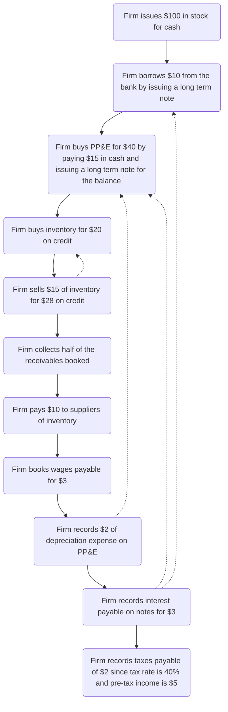

# 1 INTRODUCTION
## 1.1 The Purpose of Financial Accounting

- The U.S. Congress passed a law in 2002, known as the Sarbanes-Oxley Act (or “SOX” for short), that requires the Chief Executive Officer and the Chief Financial Officer to certify the firm's Financial Statements

## 1.2 Financial Accounting for Private Sector, For-Profit, Publicly Traded Corporations

- 
- S-Corporations are so-named because the tax requirements fall under Sub-Chapter S of Chapter 1 of the U.S. Internal Revenue Code
- Although LLCs and S-Corporations have certain benefits that are not granted to sole-proprietorships, their ownership structures have limits that prevent massive accumulation of capital, thereby typically limiting their size

## 1.3 Standard Setters and Auditors

- In the U.S., the accounting rules are written by the Financial Accounting Standards Board (FASB), located in Norwalk, Connecticut. This organization is under the jurisdiction of the SEC
- IASB GAAP is commonly referred to as International Financial Reporting Standards (IFRS). There are many GAAPs in the world – IASB and U.S. GAAP are the two most common GAAPs for publicly traded firms

## 1.4 Basic Terminology and Methodology

- 🔑 Assets = Liabilities + Owners' Equity
- The first sale of stock to public investors is called the Initial Public Offering (or IPO)
- Later, if it decides to sell more stock publicly, these subsequent sales are called Seasoned Equity Offerings (or SEO)

| Scenario | Double Entry |
|--|--|
| Borrow $100 Cash |  |
| Sell $100 Stock |  |
| Buy a Building |  |
| Buy Inventory |  |
| | |

### Balance Sheet

- The Balance Sheet is a listing of the balances from the ledger. As the name suggests, it shows the balances at a point in time. The “Begin” and “End” rows above (in the ledger) would represent this firm’s consecutive Balance Sheets
- Sell Inventory
    - 
    - Revenues (also called Sales) are recorded as increases in Owners’ Equity 
    - Cost of Goods Sold is recorded as a reduction in Owners’ Equity
- Pay Wages
    - 

### Income Statement

- Retained Earnings is the cumulative amount of Net Income that the firm has earned since its inception
- Whenever a firm decides to pay a dividend to its owners, Retained Earnings are reduced
- These are the cumulative earnings of the firm that are not paid out as dividends to owners

### Cash Flow Statement

- Operating cash flows – from customers and to suppliers
- Investing cash flows – for purchases of buildings and some other items
- Financing cash flows – to and from lenders and investors

*We point out the “dates,” namely the fact that the Balance Sheet is reported “as of” a particular point in time and the Income Statement and the Statement of Cash Flows are reported “for a period of time.” The reasons are because the Balance Sheet is a cumulative statement (a summation of events at a particular point in time), whereas the other two statements contain results over a reporting period, either one year or quarter. Also, below, we expand the Statement of Cash Flows to give some additional detail.*

## 1.5 Closing the Books

- The purpose of the closing entry is to re-set the balances in the revenue and expense accounts to zero so that they can accumulate the next period’s revenues and expenses
- Revenues and expenses hold their account balances temporarily-- they are called temporary accounts which are closed at the end of each accounting period

# 2 ADDITIONAL TERMINOLOGY, CONCEPTS, AND METHODOLOGY

## 2.1 The Accounting Cycle

Public firms in the U.S. must report their financial results quarterly. This means that they go through the so-called Accounting Cycle quarterly. The accounting cycle has four basic steps, outlined below.

1. The identification of accounting events. Accounting events are all events that firms are required to disclose under the accounting rules. The disclosures are made either in the Financial Statements or in the notes to the Financial Statements. Respectively, these are called “statement disclosures” and “note disclosures.” Both are important sources of information.
1. The valuation of accounting events. Firms must measure the events by putting a monetary value on them, if possible.
1. The recording of accounting events. Firms must formally record events in the accounting system so that they will be properly disclosed. Recording means that the firm either journalizes the event or provides a note disclosure, depending upon whether the event requires statement recognition (in which case the event is journalized) or note disclosure.
1. The disclosure of accounting events. Firms must generate a set of Financial Statements, along with the required note disclosures.

## 2.2 Capitalize vs Expense

1. Capitalize means that an asset increases
    1. When the pencil sharpener is capitalized, one asset is replaced by another (office equipment for cash).
    1. Notice that when the pencil sharpener is capitalized (the first instance above) the net effect on the firm is zero. The firm’s equation (Assets = Liabilities + Owners’ Equity) is unchanged. When the pencil sharpener is expensed, the firm “shrinks,” as both sides of the equation are reduced by $10.
1. Expense means that Owners’ Equity decreases
    1. When the pencil sharpener is expensed, both Assets and Owners’ Equity are decreased. The Owners’ Equity account is “Office Expense.” By way of semantics, we say that the effect of the expense is a reduction in Owners’ Equity, or we say that the expense is charged against the owners.
    1. If the pencil sharpener is capitalized, it will be expensed later, over time, in a systematic way, via the process of depreciation.

In both of the above instances, cash is reduced by $10. However, in the first instance, an asset account is increased to offset the decrease in cash. In the second instance, Owners’ Equity is decreased to offset the decrease in cash.

## 2.3 Gains and Losses vs Revenues and Expenses

Revenues vs Gains: when the firm’s central activity is selling inventory, the sale of the equipment results in a gain. 

- Intuitively, the gain is the difference between the fair value of the equipment ($1,000) and its book value listed on the Balance Sheet ($800).
- When the firm’s central activity is selling equipment, then the equipment would be classified as ”inventory,” and the firm would report revenue of $1,000 and an expense (Cost of Goods Sold) of $800 in the transaction. Notice that the result of the two different treatments is identical. 
- Assets increase by $200 (net) and Owners’ Equity increases by $200 (net). 
- The difference is in the level of detail. Peripheral activities are reported on a “net” basis; central activities are reported as two numbers, or on a “gross” basis (Revenues less COGS).

 ## 2.4 Statutory vs Effective Tax Rates

 1. Effective Tax Rate = Tax Expense / Pre-Tax Income
 1. When a firm uses a mixture of statutory rates, the Effective Tax Rate can differ from the local Statutory Tax Rate
 
 ## 2.5 Alternative Methods for Data Capture

 1. Debits are on the left, and credits are indented, thus on the right. In our context, debit simply means left, and Credit means right. 
 1. Debit does not mean “bad” or “negative” and credit does not mean “good” or “positive.”
1. There are no negative numbers with conventional journal entries.
1. Assets increase with debits and decrease with credits.
1. Liabilities and Owners’ Equity do the opposite. They increase with credits and decrease with debits.
1. Revenues, since they increase Owners’ Equity, are credits.
1. Expenses, since they decrease Owners’ Equity, are debits.

To add more structure to the instructions for the conventional journal entries, let’s outline some steps.

1. Identify the individual accounts involved in the transaction or event.
1. Classify the accounts in step 1 as Assets, Liabilities, or Owners’ Equity.
1. Determine whether the accounts are increasing or decreasing. (Remember that Revenues will be a credit because they increase Owners’ Equity, and expenses will be a debit because expenses decrease Owners’ Equity.)

# 3 PRACTICAL LOOK AT THEORETICAL ISSUES

## 3.1 Life Cycle of the Firm and the NI/CF Profile

Cash Flow Statement Impacts

1. Intro Phase
    1. When firms are just getting started, they usually have negative Net Income (a net loss) and negative CFO. This happens because it takes time (and money) to “set up shop,” identify a customer base, market to the customers, buy and deliver inventory, etc.
    1. Additionally, the firm is investing in infrastructure (equipment and buildings, e.g.), so its CFI will be negative. This means that cash is “going out” of the firm into these long-lived assets.
    1. If Net Income, CFO and CFI are all negative, the firm will definitely need outside sources of cash. Without cash, nothing happens. Thus, CFF will be positive. Cash will come from lenders and investors.
1. Growth Phase
    1. During the “growth phase,” CFO ceases being as negative and eventually turns positive. We say that the firm becomes “cash flow positive,” meaning that CFO becomes positive. 
    1. CFI will likely remain negative as the firm continues to spend cash on various long-lived assets such as buildings and equipment. 
    1. CFF often continues positive during the growth phase, since the firm still needs outside financing in order to fund its growing operations and investments in buildings, etc.
1. Mature Phase: During the “mature” phase, CFO is generally positive. CFI slows down as the firm has fewer investment opportunities. Also in the mature phase, CFF often turns negative, as the firm starts to pay down debt and to return cash to investors in the form of share repurchases and dividends.
1. Decline Phase
    1. Finally, during the decline phase, the firm’s CFO can turn negative as the firm is unable to sustain healthy operations.
    1. Firms may have to resort to selling assets to raise cash. In this case, CFI can become positive. Positive CFI means that the firm is liquidating assets to raise cash.

## 3.2 Predicting Cash Flows

- Future Financial Statements are called *pro forma statements*, or forecasted statements. 
- Pro forma means for the sake of form, or ”as if”. 
- One of the primary purposes of pro forma statements is to try to determine the firm’s future cash flows. 
- Most decisions concerning firms (for example, whether to buy a firm’s stock or to lend money to a firm) require an estimate of the firm’s future cash flows and sustainable cash generating ability.

## 3.3 Debt vs Equity

- Debt
    - Equity financing is more expensive than debt financing. 
    - Lenders can use various legal means to protect their claims, such as requiring collateral or limiting the use of the borrowed money. 
    - Such protections reduce lenders' risk, and when risk is lower, the "cost of capital" (the interest rate on the debt) is typically lower.
    - Debt is cheaper for another reason. Governments often subsidize debt financing by allowing tax deductions for interest payments. Therefore, debt has a tax advantage that makes it relatively cheaper than equity.
    - The use of debt has another advantage. It allows the firm to ⏴leverage⏵ earnings to the benefit of shareholders.
- Equity
    - “Stockholders” or “shareholders” are ways of describing the owners of equity. That is, the equity owner has purchased the firm’s stock (shares of ownership in the firm).
    - Stockholders do not have the same ability to protect their claims through collateral. Since stockholders assume more risk, they demand a higher return on their investment.
    - Dividends are usually not deductible. Deductions reduce the amount of taxable income and therefore the amount of money that firms would have to pay the government for taxes. 
- Convertibles
    - A mix between debt and equity is called a “convertible” or “convertible debt.” 
    - The terms of these hybrid investment vehicles vary but typically take the form of debt that are convertible into shares of stock. 
    - In other words, the debtholders earn a fixed return, but they could convert to stockholders and share in the extra returns. 
    - Once the conversion to shares of stock has been made, the investor has lost this debtholder status and is now a stockholder. 

## 3.4 Institutional and Theoretical Background

### SEC

#### Origin of the SEC

1. Overall, the purpose of the SEC is to ensure that full and fair disclosures are made to all investors before initial offerings and then afterwards in the secondary markets.
1. The SEC’s authority was granted by the U.S. Congress. The stock market “crash” of 1929 prompted the U.S. Congress (in 1933 and 1934) to institute changes that would hopefully reduce the likelihood of a repeat crash. 1. Congress passed the Securities Act in 1933 and the Securities Exchange Act in 1934. The Securities Act of 1933 regulates IPOs of securities— both stocks and bonds. 
1. The 1934 Securities Exchange Act regulates the subsequent trading of securities. It also created the SEC—the monitor that enforces the 1933 Act.

#### Filings

1. Form 10-K (annual filing, which includes the basic Financial Statements and notes plus other non-financial information)
    1. 10-Ks are required filings for all publicly traded firms in the U.S. 
    1. Firms may also elect to prepare another report called an Annual Report which is not required by the SEC. Annual Reports can be found in the “Investor Relations” section of a firm’s website. 
    1. The difference between an Annual Report and a 10-K is sometimes negligible. However, Annual Reports are often prepared for a wider array of users such as customers, potential employees and the mainstream press. 
1. Form 10-Q (quarterly filing of financial and non-financial information)
1. Form 8-K (filing after a significant event occurs, such as changes in directors, officers, or accountants)
1. Proxy (request for voting rights to be exercised at the annual shareholders’ meetings) 
    1. Generally, shareholders have the right to vote for directors of the firm and on other important matters, which are described in the proxy. Also included in the proxy is information on executive compensation.
    1. The technical form number assigned by the SEC to Proxies are Definitive 14-As or “Def 14-A” for short. 1. Other important information that you can find in Proxies include who the firm considers to be its peers (or firms with operations comparable to their operations). This type of insight is extremely helpful when analyzing a firm.

