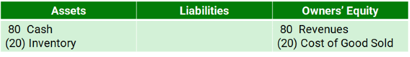

# 1 INTRODUCTION
## 1.1 The Purpose of Financial Accounting

- The U.S. Congress passed a law in 2002, known as the Sarbanes-Oxley Act (or “SOX” for short), that requires the Chief Executive Officer and the Chief Financial Officer to certify the firm's Financial Statements

## 1.2 Financial Accounting for Private Sector, For-Profit, Publicly Traded Corporations

- 
- S-Corporations are so-named because the tax requirements fall under Sub-Chapter S of Chapter 1 of the U.S. Internal Revenue Code
- Although LLCs and S-Corporations have certain benefits that are not granted to sole-proprietorships, their ownership structures have limits that prevent massive accumulation of capital, thereby typically limiting their size

## 1.3 Standard Setters and Auditors

- In the U.S., the accounting rules are written by the Financial Accounting Standards Board (FASB), located in Norwalk, Connecticut. This organization is under the jurisdiction of the SEC
- IASB GAAP is commonly referred to as International Financial Reporting Standards (IFRS). There are many GAAPs in the world – IASB and U.S. GAAP are the two most common GAAPs for publicly traded firms

## 1.4 Basic Terminology and Methodology

- 🔑 Assets = Liabilities + Owners' Equity
- The first sale of stock to public investors is called the Initial Public Offering (or IPO)
- Later, if it decides to sell more stock publicly, these subsequent sales are called Seasoned Equity Offerings (or SEO)

| Scenario | Double Entry |
|--|--|
| Borrow $100 Cash |  |
| Sell $100 Stock |  |
| Buy a Building |  |
| Buy Inventory |  |
| | |

### Balance Sheet

- The Balance Sheet is a listing of the balances from the ledger. As the name suggests, it shows the balances at a point in time. The “Begin” and “End” rows above (in the ledger) would represent this firm’s consecutive Balance Sheets
- Sell Inventory
    - 
    - Revenues (also called Sales) are recorded as increases in Owners’ Equity 
    - Cost of Goods Sold is recorded as a reduction in Owners’ Equity
- Pay Wages
    - 

### Income Statement


- Retained Earnings is the cumulative amount of Net Income that the firm has earned since its inception
- Whenever a firm decides to pay a dividend to its owners, Retained Earnings are reduced
- These are the cumulative earnings of the firm that are not paid out as dividends to owners

### Cash Flow Statement


- Operating cash flows – from customers and to suppliers
- Investing cash flows – for purchases of buildings and some other items
- Financing cash flows – to and from lenders and investors

*We point out the “dates,” namely the fact that the Balance Sheet is reported “as of” a particular point in time and the Income Statement and the Statement of Cash Flows are reported “for a period of time.” The reasons are because the Balance Sheet is a cumulative statement (a summation of events at a particular point in time), whereas the other two statements contain results over a reporting period, either one year or quarter. Also, below, we expand the Statement of Cash Flows to give some additional detail.*

## 1.5 Closing the Books

- The purpose of the closing entry is to re-set the balances in the revenue and expense accounts to zero so that they can accumulate the next period’s revenues and expenses
- Revenues and expenses hold their account balances temporarily-- they are called temporary accounts which are closed at the end of each accounting period

# 2 ADDITIONAL TERMINOLOGY, CONCEPTS, AND METHODOLOGY

## 2.1 The Accounting Cycle

Public firms in the U.S. must report their financial results quarterly. This means that they go through the so-called Accounting Cycle quarterly. The accounting cycle has four basic steps, outlined below.

1. The identification of accounting events. Accounting events are all events that firms are required to disclose under the accounting rules. The disclosures are made either in the Financial Statements or in the notes to the Financial Statements. Respectively, these are called “statement disclosures” and “note disclosures.” Both are important sources of information.
1. The valuation of accounting events. Firms must measure the events by putting a monetary value on them, if possible.
1. The recording of accounting events. Firms must formally record events in the accounting system so that they will be properly disclosed. Recording means that the firm either journalizes the event or provides a note disclosure, depending upon whether the event requires statement recognition (in which case the event is journalized) or note disclosure.
1. The disclosure of accounting events. Firms must generate a set of Financial Statements, along with the required note disclosures.

```mermaid
flowchart TB
    DIR()
```